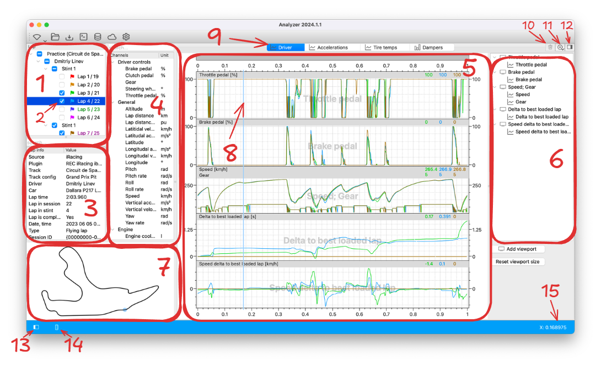
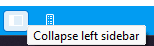
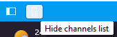
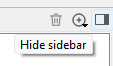
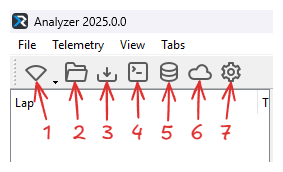
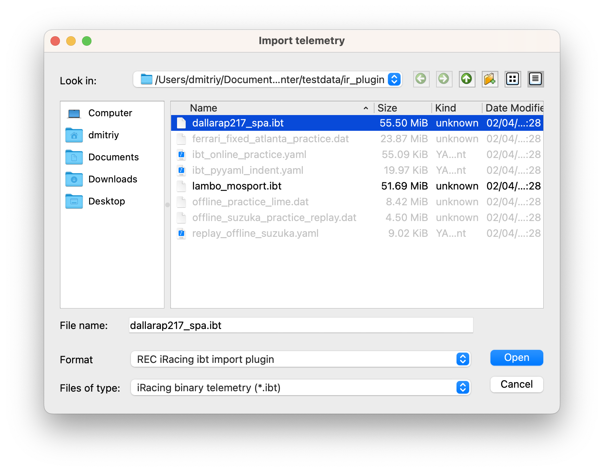

# Analyzer

The REC Analyzer desktop application is designed to provide comprehensive telemetry analysis capabilities for racing 
simulators on your desktop computer. Whether you're a racing professional, a dedicated sim racer, or an enthusiast, 
the Analyzer is here to help you extract valuable insights from your telemetry data and optimize your performance.

## Main features

Visualize and Interpret Data:

  * Explore detailed telemetry data, including speed, acceleration, braking, steering angles, and more
  * Gain insights into your driving techniques and identify areas for improvement
  * Visualize telemetry information through specially designed customizable graphs

Compare and Contrast:

  * Analyze multiple laps or sessions simultaneously to identify patterns and uncover trends
  * Compare your performance with that of other drivers or reference data to benchmark your progress
  * Highlight variations in driving lines, braking points, and cornering strategies for targeted analysis

Performance Optimization:

  * Pinpoint areas of your driving that can be optimized for faster lap times
  * Analyze the effects of setup changes and fine-tune your vehicle configurations

## User interface overview

This section provides an overview of the key graphical user interface (GUI) elements within the REC Analyzer 
application.

Main GUI elements:

1. List of all laps loaded into the app
2. Selected lap
3. Info about the selected lap
4. List of all available channels
5. Telemetry analysis widgets
6. Telemetry analysis widget settings 
7. Track scheme
8. Cursor that shows current position of a car (synchronized across different widgets)
9. Analysis tabs 
10. Open previously closed tabs
11. Add new analysis tab
12. Collapse/expand telemetry analysis widget settings
13. Collapse/expand left instruments panel
14. Collapse/expand channels list
15. Cursor value details

## Managing GUI layout

You can show and hide different elements in the Analyzer main window to save space and make
the user interface more convenient. 

To hide and show the left sidebar (Lap tree, Lap info and Channel list) click Collapse left sidebar
button in the main status bar.

You can also grab the splitter between the left sidebar and telemetry view and drag it all the way to
the left collapsing the left sidebar. Note that the icon in the status bar will change and you can
click it to restore the sidebar. 

You can also hide the Channels list to give you more space to see lap time deltas. To hide or show Channels
list click Hide channels list button in the main status bar

You can also hide the widget control panel (located to the right of the analysis widget) by clicking
"Hide sidebar" button on the top right corner. We recommend to do this when you're done setting up
your widgets to have more space for the actual data.

## Telemetry toolbar overview

The main toolbar provides quick access to essential features and windows. 

1. Connect to data source and start receiving data
2. Open telemetry file (native REC format) from disk
3. Import telemetry file (external format) from disk
4. Open scripting window (see [scripts](scripts.md) for details)
5. Open Lap library window (see [lap library](laplibrary.md) for details)
6. Open Cloud window (see [Garage61 client](cloud_db.md) for details)
7. Open preferences window (see [preferences](preferences.md) for details)

!!! note
    On macOS the telemetry toolbar is hidden by default to save screen space. You can show it by checking the 
    main menu item View -> Toolbars -> Telemetry. All main toolbar features are also available in the main menu.

## Opening telemetry

### Opening REC native telemetry files

Telemetry files saved by REC (with the .rec extension) can be opened in two different ways. 

If a file is located within local lap library, it can be loaded using lap library window. Open lap library
window, choose laps to load and simply drag them to lap list in the main Analyzer window. Please refer
to the [lap library](laplibrary.md) section for details.

If a .rec telemetry file is located outside lap library you can open it with the "Load telemetry" toolbar or menu
item. Click "Load telemetry", select file(s) to open in the file dialog and hit "OK" to load selected files.

!!! note
    We recommend to save laps to lap library if you plan to work with them. Lap library is the most convenient 
    way to organize telemetry files.  

### Importing external files

If your telemetry file is in an external format (non-REC native), REC Analyzer allows you to import it 
using the "Import" menu item. In an import dialog select a file (or multiple files) you want to import,
select a plugin to use for import in a Format dropdown list and hit Open.

REC Analyzer currently supports the following telemetry formats:

- iRacing .ibt files
- CSV files generated by MoTeC (only files converted by mu from iRacing .ibt files were tested, 
other sources are not supported)

!!! note
    We recommend to save imported laps to library. REC uses compression to reduce telemetry files size
    so this can save a significant amount of disk space.
