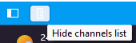
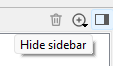

# Analyzer

REC Analyzer — приложение для анализа телеметрии гоночных симуляторов. Позволяет
детально разбирать данные с заездов, находить точки для улучшения и отслеживать
прогресс.

## Основные возможности

Визуализация данных:

- Просмотр телеметрии: скорость, ускорение, торможение, углы руля и другие каналы
- Анализ техники пилотирования и поиск слабых мест
- Настраиваемые графики для удобного отображения данных

Сравнение кругов:

- Одновременный анализ нескольких кругов или сессий
- Сравнение с другими пилотами или эталонными данными
- Наглядное отображение различий в траекториях, точках торможения и прохождении
    поворотов

Работа над скоростью:

- Поиск возможностей для улучшения времени круга
- Анализ влияния изменений в настройках машины

## Обзор интерфейса

Основные элементы интерфейса REC Analyzer:

1. Список загруженных кругов
1. Выбранный круг
1. Информация о выбранном круге
1. Список доступных каналов
1. Виджеты анализа телеметрии
1. Настройки виджета
1. Схема трассы
1. Курсор текущей позиции (синхронизирован между виджетами)
1. Вкладки анализа
1. Открыть закрытые вкладки
1. Добавить вкладку
1. Свернуть/развернуть настройки виджета
1. Свернуть/развернуть левую панель
1. Свернуть/развернуть список каналов
1. Значения под курсором

## Настройка рабочего пространства

Элементы интерфейса можно скрывать для экономии места.

Левая панель (список кругов, информация о круге, каналы) сворачивается кнопкой в
строке состояния:

Можно также перетащить разделитель между панелью и областью телеметрии до упора влево.
Для восстановления — нажмите на изменившуюся иконку в строке состояния.

Список каналов скрывается отдельно — это даёт больше места для дельты времени каждого
круга:

Панель настроек виджета справа скрывается кнопкой в правом верхнем углу. После
настройки виджетов её можно убрать, чтобы видеть больше данных:

## Панель инструментов

Быстрый доступ к основным функциям:

1. Подключение к источнику данных
1. Открыть файл телеметрии (.rec)
1. Импорт телеметрии из внешнего формата
1. Окно скриптов (см. [scripts](scripts.ru.md))
1. Библиотека кругов (см. [lap library](laplibrary.ru.md))
1. Облако Garage61 (см. [Garage61 client](cloud_db.ru.md))
1. Настройки (см. [preferences](preferences.ru.md))

!!! note

    На macOS панель инструментов по умолчанию скрыта. Включить: View → Toolbars →
    Telemetry. Все функции также доступны через главное меню.

## Открытие телеметрии

### Файлы REC

Файлы .rec можно открыть двумя способами:

**Из библиотеки кругов:** откройте окно библиотеки, выберите нужные круги и перетащите
их в список кругов. Подробнее — в разделе [lap library](laplibrary.ru.md).

**С диска:** используйте кнопку или пункт меню "Load telemetry", выберите файлы в
диалоге.

!!! note

    Рекомендуем сохранять круги в библиотеку — так удобнее организовать работу с
    телеметрией.

### Импорт внешних форматов

Для импорта файлов других форматов используйте пункт меню "Import". В диалоге выберите
файлы и укажите формат в выпадающем списке.

Поддерживаемые форматы:

- iRacing .ibt
- CSV из MoTeC (протестированы и поддерживаются только файла, сконвертированные с 
  помощью утилиты mu из .ibt из iRacing)

!!! note

    Импортированные круги лучше сохранить в библиотеку. REC сжимает данные — например,
    360 МБ .ibt превращаются примерно в 100 МБ в формате .rec.
