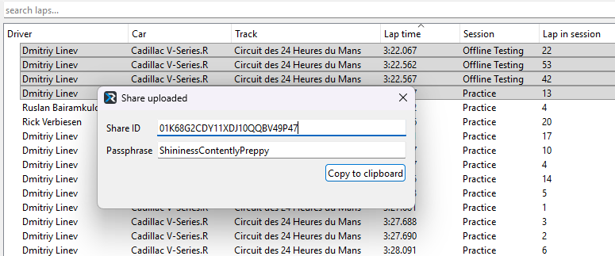
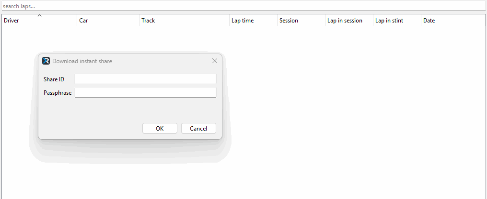

# Instant share

You can quickly share your telemetry with teammates by using REC Instant Share feature. It allows you to upload your 
telemetry to the cloud so others can download it. The share is short-lived and will be automatically deleted from the 
server after an hour. You can upload up to 5 laps in a single share.

## Usage

Uploading instant share is available in the Lap library window. Select up to 5 laps from your library, right click on
any of the selected laps and in the context menu click "Upload instant share".


After uploading is finished a window with the result will appear:



Anyone who has this info will be able to download your telemetry. You can press **"Copy to clipboard"** button to 
quickly copy all the necessary info to clipboard. Then just send it over any one of your favorite messengers like Discord:

<!-- cSpell:disable -->

```
Share ID: 01K68G2CDY11XDJ10QQBV49P47
Passphrase: ShininessContentlyPreppy
```

<!-- cSpell:enable -->

!!! Note
    Share is only available within an hour after uploading.

To download the instant share open a Lap library window, click **"Laps"** main menu item and click 
**"Download instant share"**.


Paste the Share ID and Passphrase in the window:



Note that you don't have to paste Share ID and passphrase separately, if you copied the whole message you can just 
hit Ctrl+V on any of the fields in this dialog and it will automagically fill the necessary fields as shown in the gif 
above.

After a short period of downloading shared laps will appear in your Lap library.

!!! Note
    Anyone who has a Share ID and a passphrase can download the share, so keep this info private if you want to keep
    your telemetry private.
