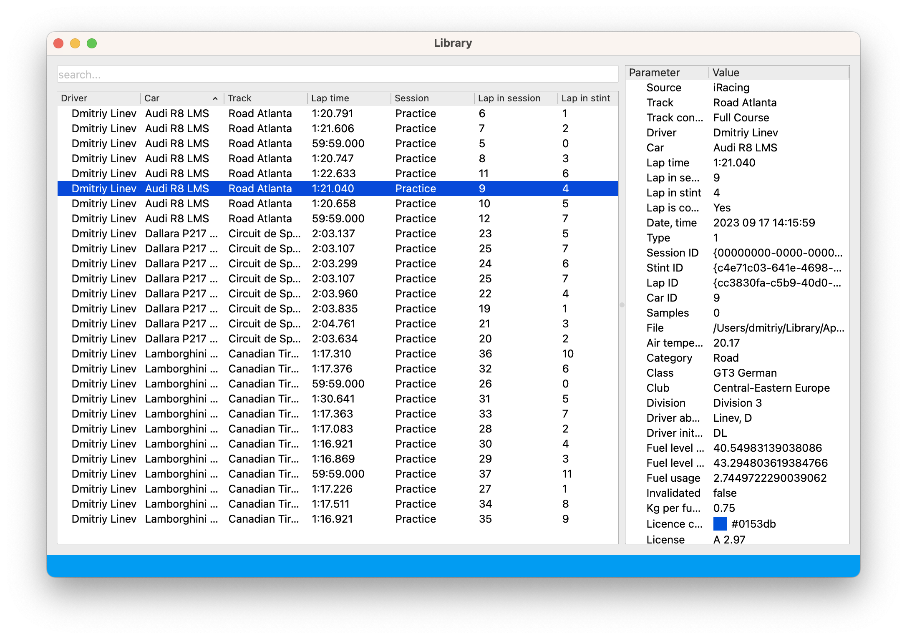
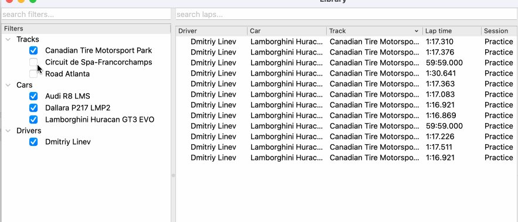

# Lap library

Lap library is a convenient way to organize your telemetry and quickly find laps you
need.

To the left you can see all tracks, cars and drivers that are available in your local
lap library. Uncheck any item in this tree to hide laps you are not interested in now.
This doesn't remove them from library, just hides for your convenience.

The same way as for the lap tree in the main Analyzer window, you can hold Alt on
Windows (or Option on macOS) to show a corresponding item and hide all other items.

analyzer_library_tree_selection.gif

!!! note

    Filter selection is saved and restored between runs of Analyzer so that you can pick up
    right where you left off.

You can also filter laps using "search" field in the top of the Library window.

You can type your query into the filter field to dynamically update the table and
display only the rows that match the query. Rows that do not contain all the specified
words in the query will be hidden from view. The filter treats the words within the
query as logical "AND" operators, so a row must contain all the words from the query to
be shown.

You can combine both ways of filtering out laps to quickly find laps you want to select
for analysis.

## Loading laps for analysis

To load laps for detailed analysis, select laps in Lap library window and drag them into
Lap info list. For more details about Lap info list, please refer to the
[Lap info list documentation](laps.md)
