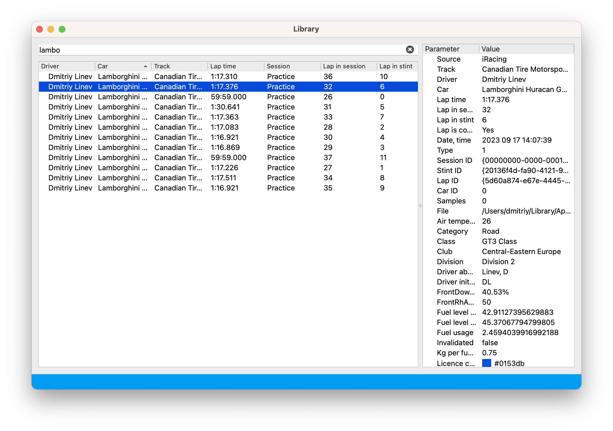

# Lap library

Lap library is a convenient way to organize your telemetry and quickly find laps you need. 

Filter laps using "search" field in the top of the Library window. 

As users type their query into the filter field, the table dynamically updates to display only the 
rows that match the query. Rows that do not contain all the specified words in the query are hidden from view.
When users enter a query, the filter treats the words within the query as logical "AND" operators. 
This means that in order for a row to be displayed, it must contain all the words from the query.

## Loading laps for analysis

To load laps for detailed analysis, select laps in Lap library window and drag them into Lap info list. 
For more details about Lap info list, please refer to the [Lap info list documentation](laps.md)
