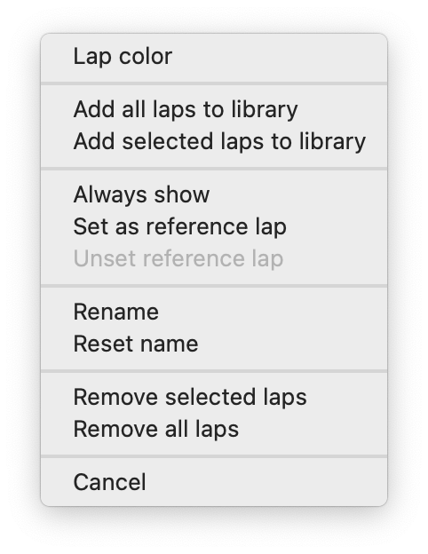

# Working with laps

Lap list provides convenient way to organize laps you work with in a current analysis session. It uses
a hierarchical organization for your laps, that consists of four levels: session, driver, stint, and lap.

Each lap row contains info about lap name, lap time, delta to best loaded lap and delta to best lap in stint.

Each lap is marked with flag with the color corresponding to this lap. All graphs for this lap in telemetry
widgets will have the same lap to easily distinguish different laps.

## Switching between laps

Use the lap tree to show and hide laps. When you uncheck a lap checkbox in the lap tree, all corresponding 
graphs will be hidden in all analysis widgets. Hold Alt (Option on macOS) and click on a checkbox to
show this particular lap and hide all other laps. To make comparing laps even more convenient, you can use
[Always show](#always-show) feature

## Organizing laps

You can change color of a selected lap or multiple selected laps with a context menu. Right mouse click on
a lap in the lap tree (or select several laps and right mouse click on any one of them), select "Lap color"
in a context menu, select a color you want for your lap(s) and hit "OK". 

In this context menu you can also add selected laps or all laps to library (please refer to the 
[lap library](laplibrary.md) section for details), and remove laps from analysis.

!!! note
    "Remove" laps will only unload them from analysis but won't delete actual files from disk.

Analyzer automatically assigns a name to all sessions, drivers, stints, and laps. You can change the name of 
any session, driver, stint, or lap for further customization. Right mouse click on a corresponding item in 
the lap tree, select "Rename", enter a new name and hit "OK". Empty names are not allowed. 

To reset a lap name to a default, right mouse click on a corresponding item in the lap tree and select 
"Reset name".

!!! note 
    Analyzer is able to save names that you assigned to your laps between runs of the application **only 
    if these laps are saved to the Lap library**

Use "Reset name" context menu item to unset your custom name if you no longer need it.

## Reference lap

By default REC computes deltas (for example time delta or speed delta) against the fastest loaded lap. If
you want to use another lap as a base lap for delta calculation, right mouse click on a corresponding item 
in the lap tree and select "Set as reference lap". Note that reference lap is shown bold in a lap tree. 

To go back to using your fastest lap as reference, right mouse click on a corresponding item in the 
lap tree and select "Unset reference lap".

## Always show

You can enable "always show" mode for a specific lap (or multiple laps). In this mode a lap is always visible
and it won't be hidden even if you try to uncheck it manually. It also won't be hidden with Alt+click on another
lap.

!!! tip
    To quickly compare your reference lap with several other laps, you can turn on "Always show" for your reference
    lap and then Alt+click on a checkbox on a lap you want to compare it with. Now to quickly hide this lap and
    show another lap keeping the reference lap visible, just Alt+click on a checkbox in a next lap you want to 
    compare.

    

## Lap info list

Lap info list contains detailed information about the lap which is currently selected in the Lap list. 
Some of the useful lap attributes shown in the lap info are:

- Driver name
- Car name
- Track name
- Session name
- Lap time
- Number of the lap in session
- Number of the lap in stint

And many more!

A list of values shown in the Lap info depends on a particular data source and version of REC used to record this
telemetry file.

For easier analysis and narrowing down the displayed parameters you can use the search field in the top of the 
Lap info panel. Simply enter the name of the parameter you're looking for, and Analyzer will dynamically 
filter and display only the parameters that match your search string. 

## Channel list

Channel list contains information about all channels available in laps that are currently loaded into Analyzer.
Channels are grouped by category for easier search. 

!!! note 
    It's possible that some of the laps does not have some of the channels listed, depending on the way these laps
    were recorded. Strictly speaking, channels listed in the Laps list are represented by the full outer join of
    the channels from all laps currently loaded into Analyzer

For each channel the corresponding unit of measure is shown in the Channel list. Analyzer automatically handles 
unit conversion for all channels if necessary. You can change the display unit for a  specific channel 
in the channel context menu. Right mouse click on channel (or select several channels and right mouse click on 
any one of them to change unit for multiple channels) and select "Change unit".  

Select a unit you want Analyzer to use for the specified channel(s) and hit "OK". Channels the new unit
will be applied to are listed in the dedicated field in the Change unit dialog. If you select several channels
with incompatible units, some of them will be excluded from this list and only the compatible units will be listed.

You can use the search field in the top of the Channel list to filter listed channels by names. Enter the name
(or just a part of the name) of the parameter you're looking for and Analyzer will filter and display only the
channels that match your search string. 
