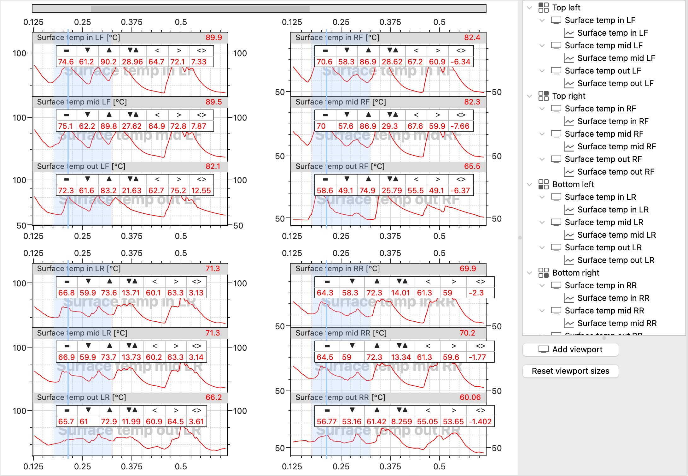

# Quadri-telemetry

This widget is very similar to the [Telemetry](widget_telemetry.md) widget, but it
provides a 2 by 2 plot layout which is very convenient for example if you need to
analyze a wheel data

## Adding channels

To add a channel to Quadri-telemetry widget, you can add a new viewport and add a
channel into this viewport. Click "Add new viewport" button on a telemetry widget
control panel on the right and then drag-n-drop a channel you want to add from the
Channel list.

If you hold Ctrl (Cmd on macOS) when dropping a channel into a telemetry widget, it will
be added into a new viewport.

In general adding channels to Quadri-telemetry widget works the same way as adding
channels to the regular Telemetry widget, except that here you can't add channels with
double-click

## Managing the tab

For details on how to add channels and how to manage and set up the tab please refer to
the [Telemetry](widget_telemetry.md#moving-channels-between-viewports) section of this
doc. Cursor and selection also work the same way, except that they are also synchronized
across all four plots in this tab.
