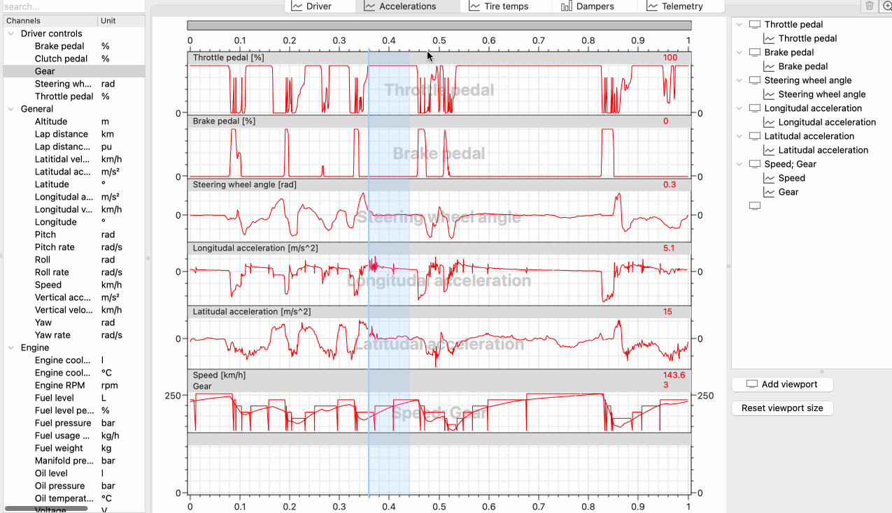

# Telemetry

Telemetry analysis widget is a comprehensive tool to visualize telemetry information, comparing performance 
metrics to uncover areas for improvement driving style or a car setup.

You can use builtin telemetry tabs to start or set up your custom tab that exactly suits your needs.

Note a zoom strip in the top part of the telemetry widget. It shows and controls which part of the lap 
you're currently looking at. Drag the whole thing left and right to move your view left and right. Drag
edges of the visible area to zoom in and out.

You can also use mouse wheel to navigate around a telemetry view. Use mouse wheel to zoom or hold Shift
to move a visible area left and right.

## Cursor and selection

### Cursor

A cursor (blue vertical line on a telemetry widget) shows a current point on a track. You can see a value
under a cursor for each graph on a viewport header. A color of the value label corresponds to the graph
color and a color of this lap in a lap tree. Move a cursor left and right with a mouse to inspect
values around your point of interest, for example to check the speed difference between two laps in some
section of the lap.

A current cursor position is also shown in a bottom right corner of the Analyzer window.

### Selection

Double-click and drag in a telemetry widget to draw a selection area. A current selection area length 
is shown in a bottom right corner of the Analyzer window.

If there's a sufficient space, the statistics for each channel of the selected area will be shown. 
A color of the value label corresponds to the graph color, value under cursor shown in a viewport header
and a color of this lap in a lap tree. By default the following information is shown

- `▬` **Average** - an *average* value of this channel on this lap inside the selected area
- `▼` **Min value** - the *minimum* value of this channel observed on this lap inside the selected area
- `▲` **Max value** - the *maximum* value of this channel observed on this lap inside the selected area
- `▼▲` **Min/max delta** - the *difference* between the minimum and the maximum value of this channel 
observed on this lap inside the selected area
- `<` **Value at selection start** - the value observed on this lap at the *start* of the the selected area
- `>` **Value at selection end** - the value observed on this lap at the *end* of the the selected area
- `<>` **Selection start/end delta** - the *difference* between the value at the start and at the end 
of the the selected area on this lap

Double-click anywhere in a telemetry widget to remove a selection area.

!!! tip

    Zoom, selection and cursor are synchronize across all tabs in a current Analyzer window. You can
    use this feature for your advantage, for example select a section of a lap you're interested in
    in one tab, switch to another tab and inspect another data within the same track section. Also all
    of those are shown on a track scheme so you can easily find yourself on a track if you got lost.

## Adding channels

The easiest way to add a channel into a telemetry widget is to double-click on it in a Channel list. This
will add the specified channel in a new viewport in the current telemetry tab.

You can also add a new viewport manually and add a channel (or several channels) into this viewport. Click 
"Add new viewport" button on a telemetry widget control panel on the right and then drag-n-drop a channel
you want to add from the Channel list. You can add as many channels as you need.

Note the blue frame showing you a viewport the channel you're dragging will be added to.

If you hold Ctrl (Cmd on macOS) when dropping a channel into a telemetry widget, it will be added into a new 
viewport.

## Moving channels between viewports

If for whatever reason you want a channel to be shown in another viewport, drag and drop it in a telemetry 
widget control panel tree on the right. 

## Setting up viewport

To set up a viewport select a viewport item in a telemetry widget control panel tree on the right. Viewport
setup widget will show up on this right panel below the control tree. In this widget you can select which
graph is used as a tick source and a mesh source in this particular viewport.

Note how Gear is selected as a left axis tick source on this screenshot and on a plot the left axis is marked
from 0 to 6 while the right one and the mesh is marked from around 80 to about 255 following limits of a Speed
channel.

## Setting up scales

To set up scale for each particular graph (or to be more precise the group of the same graphs, because it makes
no sense to change scaling of a speed graph of one lap and leave a speed graph of another lap unchanged) select 
a graph item in a telemetry widget control panel tree on the right. Graph setup widget will show up on this 
right panel below the control tree. Here you can select a scaling type of this graph. The following scaling
types are available:

- **Auto scale** means that vertical limits will be automatically selected based on all graphs in this group 
and updated each time you add or remove laps.
- **Auto on visible graphs** means that vertical limits will update automatically based on visible graphs
Scaling will update automatically each time you show or hide laps providing the most convenient 
- **Manual** means that you control scaling manually. Input values you want to use as vertical scale limits
and hit Apply for your settings to take effect.

!!! tip

    We recommend to use **Auto on visible graphs** scaling in most cases unless you really know what you're doing.
    You might need to use **Manual** scaling if you need to see multiple channels in one viewport, as for example
    in a builtin Driver tab where we have Speed channel scaled automatically and Gear channel occupying ~20% of
    the viewport height using **Manual** scaling.
