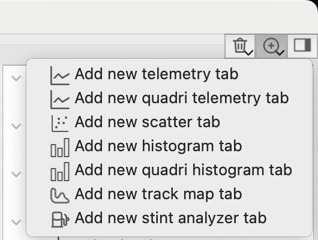

# Workbooks

Analyzer uses tabs to organize different telemetry analysis tools and widgets, allowing you to quickly
navigate through your data and get valuable insights quickly. You can open as many tabs as you want, detach
tabs to move them to another display and save presets for further reuse.

## Add a new tab

To add a new tab press a button with green plus sign in the top right corner of am Analyzer window and choose
the tab type you want to open. 

You can also use main menu item "Tabs" to do the same.

You can manually add data to a freshly opened tab, generally it's done by dragging channels from Channel list
(please refer to the corresponding [section](laps.md#channel-list) for details). For details on how to add data
to each specific type of analysis widgets please refer to the corresponding section of this manual.

## Load and save tab

REC comes with a set of builtin tabs, and you also can save your own presets to reuse them or share with your 
friends.

To load a tab right mouse click anywhere on a widget or on a tab header and click Load tab in a context menu.
You can also select Load tab in a Tab main menu. A window will open that contains all tab presets available
for this particular tab type. Select a tab preset you want to load and click OK.

To save a tab right mouse click anywhere on a widget or on a tab header and click Save tab in a context menu.
You can also select Save tab in a Tab main menu. A window will open prompting you to specify a name of your 
tab preset and a short comment. Enter a name and click OK to save a tab.

## Load and save workbook

You can also save and the whole workbook (a set of tabs). Note that REC automatically saves your current
workbook when you close the application, so you don't need to manually save it. Use this feature if you
want to share your workbook or have several workbooks for example for different simulators.

Save workbook and Load workbook windows work exactly the same way as Save tab and Load tab respectively.

## Detaching tabs

Telemetry analysis widgets are grouped as tabs for you to quickly switch between them. If you want to see
multiple tabs in the same time (for example if you work with multiple monitors and want to take advantage
of all the extra space), you can detach a tab. A detached tab behaves as a separate window you can move around
your desktop. To detach a tab use widget context menu, tab header context menu or a Tab section in the 
Main menu. Select Detach tab on a tab which is inside the main window to detach it. To attach a detached tab
use the same menu on this tab and select Attach tab.

## Restoring closed tab

If you accidentally closed a tab you need, you can still restore it. Click on a button with a trash bin icon
in the top right corner of the main window. This will show a list of recently closed tabs. Click on the one
you need to restore and it will open. You can also use Ctrl+Shit+T (Cmd+Shift+T on macOS) hotkey to quickly
restore the last closed tab, just like in your favorite browser.

Note that the recently closed tabs are not carried after you closed the app.
