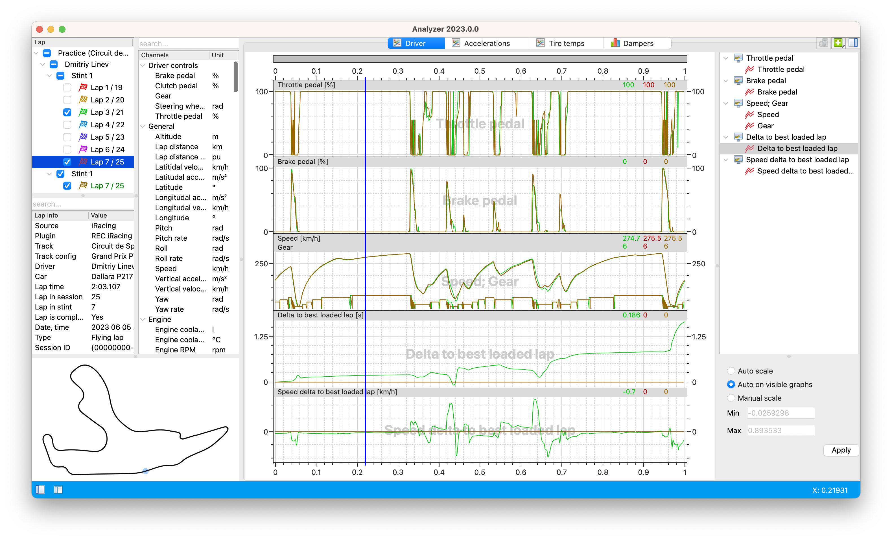

# Race Engineering Center

**Race Engineering Center** (REC) это программный комплекс для сбора анализа телеметрии, который поможет вам повысить 
результаты на трассе, предоставляя подробную информацию о поведении гоночной машины. 

## Скачать

Вы можете скачать последнюю версию REC [здесь](https://dnl.rec-telemetry.org/latest/)

## Особенности

* Быстрый и легкий интерфейс, который легко освоить, при этом обладающий мощными возможностями
* Виджеты просмотра графиков, гистограмм и кроссплотов, специально разработанные для потребностей анализа телеметрии
* Возможность сравнения нескольких кругов
* Прямой импорт телеметрии из iRacing
* Запись данных в режиме реального времени из iRacing, Assetto Corsa, Assetto Corsa Competizione и RaceRoom Racing Experience
* Пользовательские расчеты над телеметрией с использованием JavaScript
* Доступны версии для Windows и macOS
* ПО полностью бесплатно

## Что в коробке?

- [**Analyzer**](analyzer/analyzer.md) - приложение для анализа телеметрии
- [**Recorder**](recorder/recorder.md) - приложение для подключения к симуляторам и записи телеметрии

## Контакты

Вы можете связаться с нами по email <support@rec-telemetry.org>

У нас также есть сервер поддержки в [Discord](https://discord.gg/AYZ3xr6)
