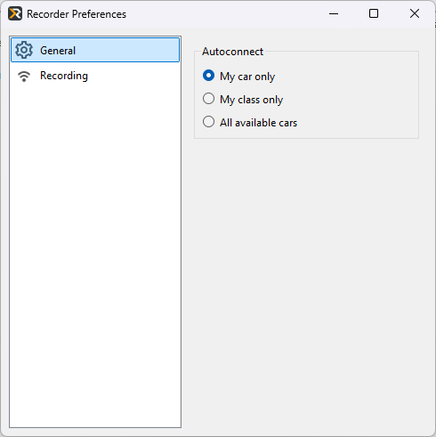
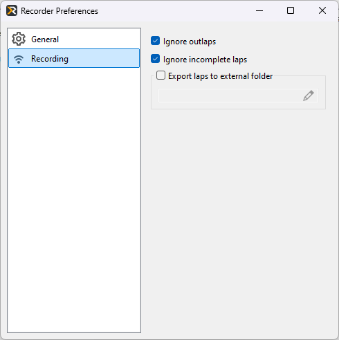

# Recorder preferences

This section describes Recorder user preferences window

## General

The Autoconnect feature includes three detailed options for controlling which telemetry data is recorded:

* **My car only**: Records telemetry only from your selected car, ignoring all others.
* **My class only**: Records telemetry from all cars in the same class as your selected vehicle.
* **All cars**: Records telemetry from all cars, regardless of type or class.

!!! note

    Please note that not all live plugins do support recording from other cars, often due to limitations
    in the data, provided by the simulator

## Recording

### Telemetry filtering

The telemetry filters section provides two options for excluding specific types of laps from recording:

* Ignore outlaps: Excludes laps that begin in the pit lane from being recorded.
* Ignore incomplete Laps: Excludes laps that end prematurely, such as when teleporting back to the pits.

These options help ensure your recorded data focuses only on meaningful lap information.

### Export laps to external folder

This is an advanced feature that allows you to share your telemetry with others via a cloud storage
(like Dropbox or Google Drive). If it's enabled and a folder on your PC is set, Recorder will copy 
each recorded lap to the specified folder so it can be automatically shared to your teammates.

