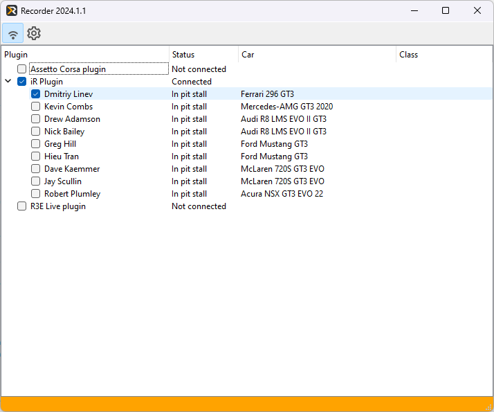

# Recorder

The REC Recorder desktop application connects to your simulator to capture and store detailed 
telemetry data for further analysis. Designed to work seamlessly with the 
[Analyzer](../analyzer/analyzer.md), it provides reliable data acquisition to support a variety 
of telemetry-driven workflows.

## Main features

  * Connects directly to supported simulators for real-time telemetry recording
  * Captures all available data data such as speed, throttle, braking, steering, and more
  * Saves telemetry data to an internal database for efficient management and retrieval
  * Provides data in a compatible format for use with the REC Analyzer or other telemetry tools
  * Ensures high-fidelity recording with minimal performance impact on the simulator

## User interface overview

This section provides an overview of the key graphical user interface (GUI) elements within the 
REC Recorder application.

Main GUI elements:

1. Autoconnect toggle
2. Show settings window
3. Available plugins and connection info

## Connection

The main section of the Recorder GUI shows a connection info. Recorder automatically detects
if a simulator is running and connects after a couple of seconds, unless user turn autoconnect
off in preferences. Each top level row shows a supported simulator (or more broadly speaking, 
a supported data source), when connected to the source, shows all available cars to record
telemetry from.

Under the hood Recorder uses plugins to connect to each simulator, so further in this manual
we can use the term "plugin" (or "live plugin") referring to some features of the recording.

There are 3 possible statuses for each data source:

* **Not connected** - connection is not available because simulator is not running
* **Connection available** - recorder detected that the simulator is running but didn't connect (yet?)
* **Connected** - recorder connected to the simulator and will record telemetry

Recorder will detect and record telemetry from all cars that are checked in the list of available
cars.

Some live plugins support recording telemetry only from your car, some on the other hand support
limited recording from other cars. Other cars data is usually very limited, but might be useful 
to quickly understand where you lose time.

When recorder is connected to the sim (status is shown as "connected" and a necessary car is checked)
it's ready to record your telemetry. Just go on track and do a quick lap, it will be recorded and
saved in the [lap library](../analyzer/laplibrary.md)

!!! note

    A recommended way of retrieving telemetry from iRacing is importing ibt file into the Analyzer
    directly, since it contains more data than if recorded in realtime. However sometimes it might
    be feasible to use recorder with iRacing, for example when you want to record data from another
    car, or grab telemetry from a replay.

Recorder can automatically ignore certain types of laps if you don't want them in your library
(for example outlaps or incomplete laps). Refer to [preferences](preferences.md) for details.
